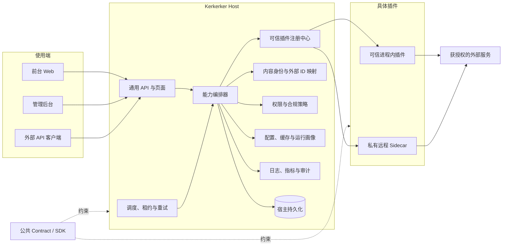
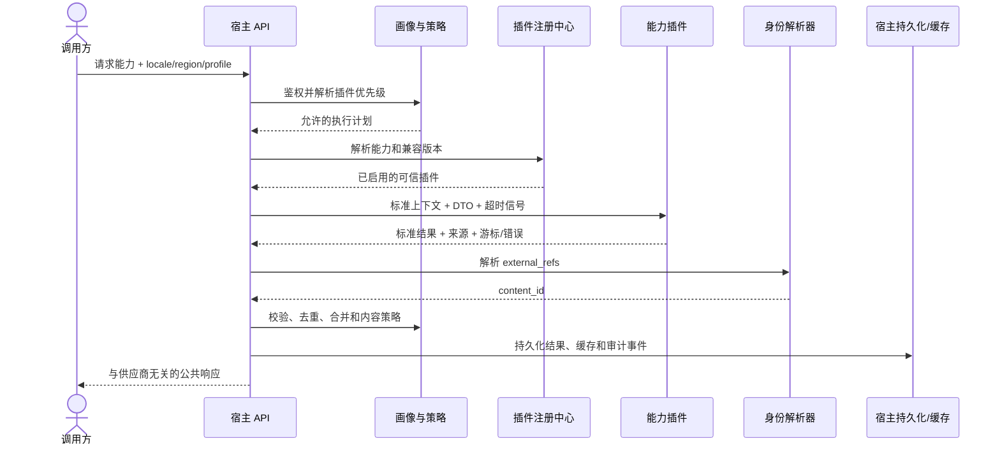

# Kerkerker 插件平台架构基线

本文是 Kerkerker 插件化改造的架构基线。后续涉及内容数据、播放资源、网盘资源、弹幕、图片、搜索和推荐的设计与代码评审，均以本文和[插件开发标准](./development-standard.md)为准。产品阶段、依赖和发布闸门见[产品开发总计划](../product-development-plan.md)。

> 当前代码尚未完全实现本文的目标架构。现有系统仍以 `douban_id`、`kkpan` 专用字段和专用路由为主；迁移期间必须保持现有业务可用，并通过兼容层逐步切换，不能把目标设计描述成已经上线的行为。

## 目标与原则

Kerkerker 的长期定位是一个可组合的影视内容宿主，而不是绑定某个数据源或资源来源的聚合站。核心原则是“万物皆插件”：任何外部能力都通过公开契约接入，宿主只保留稳定且与供应商无关的平台能力。

### 架构决策

| 决策 | 基线要求 | 原因 |
| --- | --- | --- |
| 宿主、契约、插件分离 | 主应用、公共契约/SDK、具体插件分别维护和发布 | 保持开源宿主干净，允许插件独立授权、私有化和升级 |
| 能力而非供应商建模 | 核心代码只认识 `content`、`resource.playback` 等能力 | 新增或替换供应商时无需修改核心业务 |
| v1 可信静态注册 | 插件随构建或部署配置注册，不支持后台上传和执行代码 | 限制远程代码执行、供应链和审计风险 |
| 宿主拥有数据 | 插件返回标准 DTO，不直接访问宿主 MongoDB | 保证迁移、去重、审计和权限规则一致 |
| 平台主键独立 | 所有下游数据关联宿主生成的 `content_id` | 避免被豆瓣、TMDB 或任一外部 ID 锁定 |
| 运行画像显式化 | 每次调用带 `locale`、`region` 和 `profile` | 支持中文站、英文站及地区合规差异 |
| 调度与审计集中 | 同步、重试、进度、日志和审计由宿主统一执行 | 插件可替换，运行记录仍连续可追溯 |
| 合规默认拒绝 | 未声明来源、权限、网络目标或数据用途的插件不得启用 | 让可追溯与最小权限成为默认行为 |

### 平台不负责的事项

- 插件体系不能证明某个外部数据源或资源本身合法；运营方仍需核验授权、许可、服务条款和适用地区。
- v1 不提供插件市场、运行时下载、热加载、用户上传脚本或不可信代码沙箱。
- 插件不得绕过宿主直接向页面写入供应商私有数据结构，也不得把数据库集合当作插件 API。
- 插件私有仓库不等于秘密安全。密钥必须由部署环境注入；打入公开镜像或发送到浏览器的代码仍可能被分析。

## 系统边界

### 总体架构



宿主是唯一面向页面和公共 API 的系统边界。调用方选择的是业务能力和运行画像，不直接依赖具体插件；插件优先级、回退和合并策略由宿主配置。

### 项目与发布边界

| 单元 | 目标职责 | 公开策略 | 发布方式 |
| --- | --- | --- | --- |
| `kerkerker` | Next.js 宿主、统一模型、API、后台、调度和审计 | 可公开 | 主应用镜像 |
| `kerkerker-plugin-contract` | Manifest、能力接口、DTO、错误码、兼容性测试包 | 应公开 | 独立 SemVer 包 |
| `kerkerker-plugin-*` | 某一供应商或业务能力的适配实现 | 按授权选择公开或私有 | 独立包或 Sidecar 镜像 |
| `kerkerker-douban-service` | 当前豆瓣内容服务和缓存实现 | 现有独立项目 | 作为 `content` 插件的上游服务 |

当前宿主兼容导出仍位于 [`lib/plugins/types.ts`](../../lib/plugins/types.ts)、[`lib/plugins/validation.ts`](../../lib/plugins/validation.ts) 和 [`lib/plugins/errors.ts`](../../lib/plugins/errors.ts)；可发布的 v1 契约包已位于 [`packages/kerkerker-plugin-contract/`](../../packages/kerkerker-plugin-contract/)，并由 CI 执行独立类型检查和契约测试。参考适配器可以暂时放在 [`lib/plugins/`](../../lib/plugins/) 内，以降低契约频繁调整的跨仓成本，但模块边界必须按未来可拆包设计：不能反向导入 `app/`、`components/` 或具体 MongoDB 集合。

当前分支已经落地第一批可运行地基：[`lib/plugins/registry.ts`](../../lib/plugins/registry.ts) 提供封存式静态注册，[`lib/plugins/runtime.ts`](../../lib/plugins/runtime.ts) 提供按能力和操作的统一服务端调用边界，Douban、TMDB 与 KKPAN 适配器分别位于 [`lib/plugins/adapters/douban-content.ts`](../../lib/plugins/adapters/douban-content.ts)、[`lib/plugins/adapters/tmdb-content.ts`](../../lib/plugins/adapters/tmdb-content.ts) 和 [`lib/plugins/adapters/kkpan-cloud-drive.ts`](../../lib/plugins/adapters/kkpan-cloud-drive.ts)。管理端只能通过受保护的 [`GET /api/plugins`](../../app/api/plugins/route.ts) 查看已注册的非秘密 Manifest 元数据；该接口不支持上传、动态加载或任意插件执行。

兼容的 [`GET /api/kkpan/search`](../../app/api/kkpan/search/route.ts) 已经改为通过 `cn-default` 画像调用 `resource.cloud-drive.search`，旧响应字段保留，后台无需一次性改版。宿主会创建带超时和取消信号的 `PluginContext`，并在返回前校验来源插件、资源 ID 和网盘品牌。需要原始页指纹、跨页唯一 ID 和漂移校验的全量增量/失效任务仍暂留在同步兼容层；只有当插件契约提供等价的快照或稳定游标保证后，才允许迁移到通用分页调用。

第二阶段已加入 [`lib/plugins/profiles.ts`](../../lib/plugins/profiles.ts) 的静态发布画像注册：画像固定 `locale`、`region` 和按能力排列的插件优先级，启动时校验插件是否声明该能力并支持该语言/地区；`cn-default` 绑定 Douban 内容与 KKPAN 网盘，`en-default` 的 catalog、calendar、detail、search 和 image 已绑定 TMDB，不复制页面代码，也不会回退到 Douban。运行时通过 `invokeProfilePlugin` 解析画像后再调用插件，未配置能力会返回 `CAPABILITY_UNAVAILABLE`，不会静默选择其他供应商。

宿主运行配置由 [`lib/plugins/invocation.ts`](../../lib/plugins/invocation.ts) 集中注入并按 Manifest 的必填字段、URL 类型和精确网络主机权限校验；API 路由和后台任务不得自行读取供应商环境变量。服务端页面之外的目录发现、搜索和日历任务统一通过 [`lib/plugins/content-host.ts`](../../lib/plugins/content-host.ts) 调用活动画像，`run_id`、超时和取消信号沿同一上下文传播，不通过内部 HTTP 绕回 API 路由。

生产部署通过 `KERKERKER_PLUGIN_PROFILE` 选择活动画像（默认 `cn-default`），通过 `KERKERKER_PLUGIN_REGION` 选择策略区域（默认 `CN`）。合规门禁由 `KERKERKER_COMPLIANCE_MODE` 控制：迁移期使用 `audit` 记录缺失审批但保持兼容调用，完成策略登记后切换为 `enforce`；下架记录在两种模式下都立即阻断公开读取和插件回源。画像、区域和合规模式都不是公开请求参数；同一镜像在中文部署和英文部署中只需改变部署环境与画像配置，页面和宿主 DTO 保持不变。

宿主身份层位于 [`lib/content-identity-db.ts`](../../lib/content-identity-db.ts)，集合为 `content_identities`。它只接受精确的 `(provider_id, external_id)` 引用，以宿主 UUID 生成不可变 `content_id`；同一请求发现引用指向多个身份时会报冲突，禁止标题模糊合并。网盘资源和影片同步台账在迁移期双写 `content_id` 与旧 `douban_id`，旧 API 仍保持兼容。

私有插件有两种受支持的交付形式：

1. 私有仓库构建受控插件包，并在私有部署流水线中与宿主组合成最终镜像。最终镜像也必须保持私有。
2. 私有仓库部署独立 Sidecar，宿主只通过版本化 HTTP 契约访问。Sidecar 使用服务间认证、出站白名单和独立密钥，适合需要隐藏实现、跨语言或独立扩缩容的插件。

两种形式都属于可信静态注册：插件 ID、版本、端点和启用状态在部署时确定；管理后台只能修改经过 Manifest 声明的配置，不能上传代码或任意指定可执行文件。

当前宿主已实现 Sidecar v1 的受控调用：仅允许 HTTPS 入口，入口主机必须同时出现在 Manifest 的精确 `permissions.networkHosts` 白名单中；请求带有受控上下文、请求 ID、取消信号和契约版本，响应有 1 MiB 默认大小上限。Manifest 可声明健康检查、协议版本协商和宿主注入的服务认证密钥。健康摘除、熔断和版本回退仍必须在 Sidecar 进入生产画像前完成。

### 宿主与插件职责

| 宿主负责 | 插件负责 |
| --- | --- |
| `content_id` 分配、外部 ID 映射、去重和合并 | 调用获授权的上游并返回标准候选数据 |
| 认证、授权、配置解密和密钥注入 | 声明所需配置、密钥和网络权限 |
| 路由、缓存、持久化、限流、超时和取消 | 遵守超时信号，转换上游错误和分页游标 |
| 插件选择、优先级、回退和结果合并 | 实现声明的能力，不伪报未实现能力 |
| 调度、租约、幂等、重试、进度和运行日志 | 提供可重复执行的任务入口和稳定外部 ID |
| 来源追踪、内容策略、下架和审计 | 返回来源、抓取时间、许可元数据和可验证依据 |
| 面向前台的稳定 DTO | 不泄露上游私有响应、密钥或内部异常堆栈 |

## 公共契约

### 能力分类

能力类别是稳定的业务边界，不使用供应商名称。v1 可以在类别下细分协议 ID；一个插件可以声明多个能力，但实现和测试必须按能力隔离。

| 能力类别 | v1 协议 ID | 责任 | 标准输出 |
| --- | --- | --- | --- |
| `content` | `content.catalog`、`content.calendar`、`content.detail` | 影片、剧集、季、集、人物、分类和详情元数据 | 内容候选、详情、分页列表 |
| `resource.playback` | `resource.playback` | 可播放媒体、清晰度、字幕和时效信息 | 规范化播放资源列表 |
| `resource.cloud-drive` | `resource.cloud-drive` | 网盘分享、提取码、格式、容量和可用状态 | 规范化网盘资源列表 |
| `danmu` | `interaction.danmu` | 弹幕检索、拉取和时间轴映射 | 规范化弹幕事件 |
| `image` | `asset.image` | 海报、背景、剧照、头像和镜像 | 带来源和尺寸的图片候选 |
| `search` | `content.search` | 内容或资源查询和建议 | 带类型和来源的搜索结果 |
| `recommendation` | `recommendation` | 相似内容、榜单和个性化候选 | 可解释的内容引用列表 |

`resource.playback` 与 `resource.cloud-drive` 共享资源基础字段，但不能合并成模糊的 `resource` 实现。两者的权限、可用性检测、展示方式和合规策略不同，必须独立声明和调度。
v1 的 `content.search` 是第一种搜索协议；以后增加跨域资源搜索时，必须新增兼容的分层 ID，而不是把供应商名称塞进 `search`。

### Manifest 与版本

每个插件必须提供机器可读 Manifest，至少声明：

下面的 TypeScript 片段使用公共契约包提供的 `PluginConfigFieldSummary` 类型；字段是 v1 的最小集合。

```typescript
interface PluginManifest {
  id: string;
  name: string;
  version: string;
  contractVersion: string;
  runtime: { mode: "built-in" | "package" | "remote"; entry: string };
  capabilities: Array<{ id: string; version: string; features?: string[] }>;
  locales: string[];
  config: { version: string; fields: PluginConfigFieldSummary[] };
  compliance: {
    legalBasis: string;
    termsUrl?: string;
    contentScope: string | string[];
    regions: string[];
    dataClassification: string;
  };
  permissions: {
    networkHosts: string[];
    secrets: string[];
    storage: "none" | "ephemeral" | "namespaced" | "persistent";
  };
}
```

- `id` 是全局稳定的小写反向域名或命名空间 ID，发布后不得复用给另一实现。
- `version` 遵循完整 SemVer，描述插件实现版本；`contractVersion` 使用 `major.minor` 或 `major.minor.patch`，描述公共契约版本。
- 能力版本独立声明，使宿主可以逐项检查兼容性。
- Manifest 只描述配置结构，不包含配置值或密钥。
- `runtime.mode` 只允许可信内置、受控包或远程 Sidecar；`entry` 由部署制品提供，不能来自管理员输入。
- `compliance` 描述法律依据、内容范围、地区和数据分类；宿主启动时校验 ID 唯一性、版本范围、能力实现、配置完整性和权限声明，任一关键检查失败即拒绝启用。

详细字段、错误语义和评审规则见[插件开发标准](./development-standard.md)。

### 内容身份模型

`content_id` 是宿主生成的不可变字符串 ID，v1 使用 UUID。任何供应商 ID 都只能作为外部引用，不能作为表关联键或路由层的永久主键。内容目录和资源增量发现阶段可以暂时没有 `content_id`；候选进入宿主身份解析后，必须在落库前完成归属，不能用供应商 ID 代替。当前 KKPAN 自动入库和管理员资源写入都会先解析豆瓣外部引用并补齐 `content_id`。

公共 TypeScript DTO 使用 camelCase（`contentId`、`providerId`、`externalId`）；MongoDB 等持久层可以在 repository 边界映射为 snake_case（`content_id`、`provider_id`、`external_id`），两者不能在同一契约层混用。

```typescript
interface ExternalReference {
  providerId: string;
  externalId: string;
  canonicalUrl?: string;
  verifiedAt?: string;
}

interface ContentIdentity {
  contentId: string;
  contentType: "movie" | "series" | "season" | "episode" | "person";
  externalRefs: ExternalReference[];
  createdAt: string;
  updatedAt: string;
}
```

身份解析遵循以下规则：

1. `(provider_id, external_id)` 在平台内唯一，先通过精确外部引用查找 `content_id`。
2. 同一插件重放数据必须命中原 `content_id`，不得生成重复内容。
3. 跨供应商的自动合并只能使用可解释的强证据；标题相似只能产生待审候选，不能直接合并。
4. 合并必须保留别名、原外部引用、操作者、证据和时间，且支持审计回滚。
5. 网盘、播放、弹幕、图片和推荐记录只持久化 `content_id` 与自身 `provider_id/external_id`；`douban_id` 仅作为迁移期兼容字段。

当前 [`types/pan-resource.ts`](../../types/pan-resource.ts) 仍保留必需的 `douban_id` 兼容字段，并将来源固定为 `manual | kkpan`；资源 API 已支持优先按 `content_id` 读取，详情页和旧查询仍以豆瓣 ID 兼容。来源插件的 `provider_id/provider_resource_id` 与旧 `kkpan_id` 一旦入库不可由普通编辑改绑，避免后续同步重新导入旧来源对象。以上均属于迁移对象。豆瓣服务已有的 `internal_id` 可作为 `provider_id=kerkerker.douban-service` 的外部引用或迁移映射依据，但不能成为全平台最终主键。

### 详情读取与身份写入边界

内容详情页通过宿主的 [`/api/content/detail/:externalId`](../../app/api/content/detail/[id]/route.ts) 调用当前发布画像绑定的 `content.detail` 插件。这个接口是公开的只读查询：它可以只携带精确的 `ExternalReference`，因为用户可能正在查看一个尚未写入宿主身份表的外部对象；它不得因此创建或猜测 `content_id`。插件返回的海报、评分、演职员、剧照、评论和推荐会被映射为宿主稳定 DTO，供应商原始响应、密钥和内部错误不会直接下发。

详情查询与持久化是两条不同的边界：

1. 只读详情可以使用 `(provider_id, external_id)` 查询，未找到时返回标准 `NOT_FOUND`，不写入内容库。
2. 任何资源、播放、弹幕、图片、推荐或后台同步写入，都必须先通过身份解析器把精确外部引用解析为宿主 `content_id`，再进入 repository。
3. 详情页、旧豆瓣路由和兼容 API 可以暂时接受外部 ID；它们只能把该 ID 传给选定画像的插件，不能把外部 ID 当作新的内部主键。
4. 当中文版切换为 TMDB 等其他画像时，页面和 DTO 不变，只替换画像绑定与插件来源；跨来源关联必须通过显式外部引用和身份审计完成，禁止标题模糊合并。

日历页通过宿主的 [`/api/content/calendar`](../../app/api/content/calendar/route.ts) 使用 `content.calendar` 能力。日历事件的 `eventId`、播出日期、季集数、海报和评分属于排播元数据，不等同于内容身份；只有插件明确返回精确的豆瓣外部引用时，兼容 DTO 才填充 `douban_id`，否则页面保留标题搜索回退，不能把 `show_id` 猜成豆瓣 ID。

普通分类、首页和浏览页通过 [`/api/content/catalog`](../../app/api/content/catalog/route.ts) 使用 `content.catalog` 能力。宿主声明 `category`、`featured`、`new-releases`、`sections`、`latest` 五种受控 view；`sections` 只接受 `movies | series`，`latest` 只接受宿主定义的内容类型、类型、年份、地区和排序意图。候选统一映射为供应商无关的 `items + sections + pagination`；迁移中的分类页暂时保留 `subjects` 兼容字段。插件负责把 view、key 和排序意图映射到自己的上游接口，页面不得导入具体内容服务，也不得把 `/hero`、`/new`、`sort=time` 等供应商协议写进公共契约。如果某个来源没有 Top 250 或其他分类，插件必须返回标准能力/上游错误，不能用另一分类静默替代。

`content.search` 使用可选 `intent` 区分交互搜索和后台资源匹配。`interactive` 可以合并插件声明的搜索结果；`resource-match` 必须保持来源建议顺序和宿主限定的候选数量，严格片名、年份容差与是否允许写入旧 `douban_id` 的策略仍由宿主管理，不能下沉给插件。兼容数据库尚未迁移完时，非 Douban 外部引用必须明确拒绝，不能静默写入旧命名空间。

### 运行画像

每次插件调用都携带不可变调用上下文：

- `locale`：BCP 47 语言标签，例如 `zh-CN`、`en-US`。
- `region`：ISO 3166-1 alpha-2 地区码，例如 `CN`、`US`。
- `profile`：宿主定义的发布画像 ID，绑定启用插件、优先级、回退、内容策略和缓存策略。
- `request_id` 或 `run_id`：贯穿在线请求或后台任务的追踪 ID。
- `AbortSignal`、截止时间和最小化日志接口。

插件不得根据服务器 IP、系统语言或未声明环境变量静默推断地区。插件不支持请求画像时必须返回标准的 `UNSUPPORTED_LOCALE` 或 `UNSUPPORTED_REGION`，由宿主决定回退，不得在插件内部偷换数据源。

中文站可以选择 Douban 内容插件和中国区资源策略，英文站可以选择 TMDB 内容插件及不同图片、搜索和播放插件。当前 `en-default` 已完成服务端读路径；正式启用前仍需完成 TMDB 授权材料、跨来源身份映射、R2 图片镜像和英文 UI smoke。页面与路由不需要为两套站点复制业务代码。

## 运行与数据流

### 在线请求数据流



在线请求不得直接把插件响应透传给浏览器。宿主必须完成结构校验、身份解析、URL 安全检查、来源记录和字段裁剪后才可返回。

### 调度、日志与审计

后台任务由宿主注册和运行。插件只声明任务及其执行入口，不自行创建常驻定时器或写宿主任务表。

每次运行至少记录：`run_id`、`plugin_id`、插件版本、能力、任务 ID、画像、触发方式、配置版本、开始/结束时间、游标、处理/新增/更新/跳过/失败数量、脱敏错误和最终状态。资源变化另写审计事件，记录 `content_id`、来源、变更前后摘要和操作者或任务 ID。

调度器必须提供：

- MongoDB 或等价持久层中的租约，防止多实例重复执行；
- 幂等键、分页游标和可恢复水位；
- 超时、取消、指数退避和明确的可重试错误；
- 进度与日志查询、手动执行、再次同步和停止入口；
- 日志保留期、敏感字段脱敏和审计记录不可静默覆盖。

现有 [`lib/pan/scheduler.ts`](../../lib/pan/scheduler.ts)、[`app/api/pan-resources/scheduler/route.ts`](../../app/api/pan-resources/scheduler/route.ts) 和 [`instrumentation.ts`](../../instrumentation.ts) 已提供持久化运行、租约和进程启动基础。迁移时应提取为通用插件任务运行器，而不是为新插件复制一套调度器。

### 配置与密钥

- 普通配置由宿主按 `plugin_id` 命名空间保存，写入前按 Manifest 校验类型、范围和枚举。
- 密钥只通过部署环境或受控密钥服务注入；数据库和管理 API 只保存密钥引用或“已配置”状态。
- 日志、错误、指标、浏览器响应和 Manifest 均不得出现密钥值。
- Sidecar 使用独立服务身份；不得复用管理员登录密码或公共 API Token。
- 配置变更必须记录操作者、配置版本和生效时间；密钥轮换不要求修改插件代码。

## 安全与合规基线

每个启用插件必须有明确负责人、来源说明、许可证或授权依据、数据用途、支持地区、保留策略和下架方式。平台提供技术控制和证据链，但最终合规判断由项目运营方及适用法律决定。

最低控制要求如下：

- 只加载部署时批准并锁定版本的插件；依赖和容器镜像应锁定摘要并经过 CI 检查。
- 插件出站请求仅允许 Manifest 声明的 HTTPS 主机；重定向后重新校验，复用 [`lib/url-security.ts`](../../lib/url-security.ts) 的 URL 安全规则。
- 插件输入、上游响应、分页游标和返回 DTO 均在宿主边界做运行时校验，并设置大小、页数、速率和超时上限。
- 管理配置、立即同步、停用和下架操作沿用 [`lib/auth.ts`](../../lib/auth.ts) 的管理权限边界，并写审计日志。
- 所有资源记录保留 `plugin_id`、外部 ID、来源时间和可用状态，支持按插件、内容、地区批量禁用和重新同步。
- 对用户可见的数据必须支持纠错、下架和来源追踪；删除和禁用不能只清理缓存而遗漏持久层。
- 测试夹具、日志和错误报告必须去除真实密钥、个人信息和未授权内容。
- 插件停用后不得再启动任务或回源；历史数据按策略标记、隐藏或删除，并保留必要审计记录。

## 迁移路线

迁移采用兼容层和双写/回填方式，不进行一次性重写。

| 阶段 | 交付结果 | 兼容要求 |
| --- | --- | --- |
| 1. 建立契约内核 | `lib/plugins/` 提供 Manifest、能力类型、注册中心、调用上下文和标准错误；加入参考插件测试 | 不改变现有页面和 API 行为 |
| 2. 包装现有来源 | 将 [`lib/douban-service.ts`](../../lib/douban-service.ts) 包装为内置 `content` 适配器（其上游仍是独立服务），将 [`lib/kkpan.ts`](../../lib/kkpan.ts) 与 [`lib/pan/sync.ts`](../../lib/pan/sync.ts) 包装为 `resource.cloud-drive` 适配器 | 旧入口仍通过适配层工作，核心新增代码不得出现供应商分支 |
| 3. 引入统一身份 | `content_identities` 提供精确外部引用解析与唯一索引，影片台账和资源开始双写 `content_id` | 读取先用 `content_id`，未回填记录才回退旧字段；迁移可重复执行 |
| 4. 通用化宿主 | API、后台、调度、日志和前台组件改为按能力工作；现有网盘同步器提取为通用任务运行器 | 指标验证新旧结果一致后才移除专用入口 |
| 5. 拆分与扩展 | 公共契约独立发布；私有插件迁到私有仓库或 Sidecar；接入 TMDB、播放、弹幕、图片、搜索和推荐插件 | 每个插件独立版本、权限、配置、测试和回滚 |
| 6. 清理兼容层 | 删除供应商专用数据库字段、路由和 UI 分支，文档与迁移脚本归档 | 仅在零旧读写、备份和回滚演练完成后执行 |

当前迁移状态与剩余兼容点包括：

- [`lib/douban-service.ts`](../../lib/douban-service.ts) 只由 Douban 内容适配器调用；页面、Hook、公共 API 和后台内容发现均已改走画像与宿主门面。
- [`lib/kkpan.ts`](../../lib/kkpan.ts) 仍实现供应商协议；兼容搜索路由已通过 `resource.cloud-drive.search`，同步任务通过 [`lib/plugins/resource-host.ts`](../../lib/plugins/resource-host.ts) 和 [`lib/pan/cloud-drive-task.ts`](../../lib/pan/cloud-drive-task.ts) 进入中性宿主边界。需要页指纹和漂移证明的全量增量/失效任务暂留兼容层，旧 KKPAN 页形状只能在该桥内使用。
- [`lib/pan/catalog-sync.ts`](../../lib/pan/catalog-sync.ts) 和 [`lib/pan/sync.ts`](../../lib/pan/sync.ts) 的内容目录与内容搜索已经改走 `content-host`；匹配、旧字段写入、KKPAN 稳定分页和失效策略仍由宿主兼容层负责。
- [`types/pan-resource.ts`](../../types/pan-resource.ts) 与 [`lib/db.ts`](../../lib/db.ts) 包含 `douban_id`、`kkpan_id` 和供应商专用索引。
- 管理端和资源组件仍消费旧网盘字段及兼容 API；新的内容详情、目录、搜索和日历读取不再直接依赖供应商客户端。
- [`kerkerker-douban-service`](../../../kerkerker-douban-service/README.md) 已经是独立 Go 服务，适合作为首个远程 `content` 插件适配对象。

## 架构完成定义

插件平台地基只有同时满足以下条件，才视为完成：

- 公共契约不依赖 Next.js 页面、MongoDB 驱动或任何供应商 SDK，并通过独立类型检查与契约测试。
- 宿主通过静态注册中心按能力发现插件，启动时能拒绝重复 ID、不兼容版本、缺失配置和未声明能力。
- `content_id` 成为所有资源、弹幕、图片和推荐的唯一内部关联键，外部 ID 使用唯一映射表管理。
- `locale`、`region` 和 `profile` 贯穿在线请求、后台任务、缓存键、日志和审计。
- 当前 Douban 内容来源和 kkpans 网盘来源均通过插件适配器运行，现有用户功能和自动同步没有回归。
- 新增第二个同类测试插件无需修改核心路由、数据库模型和页面中的供应商判断。
- 调度、重试、停止、进度、日志和审计可按 `plugin_id` 查询，重启及多实例情况下不会重复写入。
- 密钥不进入仓库、Manifest、日志或客户端；Sidecar 具有独立身份、超时和网络白名单。
- 插件可被单独禁用、回滚和下架，宿主在插件失败时按画像执行明确降级且不返回未校验数据。
- 迁移脚本可重复运行，旧字段清理前有备份、数据对账、回滚演练和零旧读写证据。

单个插件的交付检查见[插件开发标准中的 Definition of Done](./development-standard.md#definition-of-done)。
