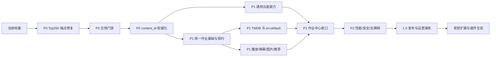

# Kerkerker 产品开发总计划

这份文档是 Kerkerker 从当前分支到 1.0 发布及后续稳定运营的唯一执行路线。它补充[插件平台架构基线](./plugin-platform/README.md)和[插件开发标准](./plugin-platform/development-standard.md)：架构基线回答“系统应该长什么样”，开发标准回答“单个改动如何验收”，本文回答“按什么顺序把产品做完”。

## 1. 产品目标

Kerkerker 的产品目标是一个可合规运营、可切换内容来源、可扩展资源能力的影视内容宿主。用户看到的是统一的内容、搜索、播放和资源体验；运营人员看到的是可审批、可下架、可追踪、可重试的后台；开发者通过插件契约接入数据源和能力，不修改宿主核心业务。

### 1.1 1.0 完成定义

1. 所有对外内容、资源、播放、弹幕、图片和推荐记录都以宿主 `content_id` 关联，外部 ID 只作为可审计引用。
2. 每个插件都有版本化 Manifest、负责人、授权依据、条款、地区范围、数据用途、保留策略和下架方式；未经批准的插件不能被调用或写入数据。
3. 中文画像和英文画像可以分别选择 Douban、TMDB 或其他已批准来源；切换画像不需要复制页面和 API 路由，也不能隐式回退到未批准来源。
4. 网盘资源、播放资源、弹幕、图片和推荐均通过能力契约接入；新增插件只需实现适配器、Manifest、配置和测试。
5. 后台可以发现全站影片、批量同步、重试单片、再次同步已同步影片、查看进度和日志，并能停止、恢复和审计任务。
6. Douban 服务的图片在启用镜像策略时稳定写入 R2，前台只使用受策略控制的图片地址；缓存失效、重启和并发刷新不会把旧图片复活。
7. GitHub Actions 在当前 `cn-compliance` 分支完成测试、构建、迁移检查、Docker 发布、部署和回滚门禁；`master` 不作为开发或部署目标。
8. 备份恢复、下架、密钥轮换、上游故障和部署回滚都有可操作的运行手册，并经过至少一次演练。

### 1.2 产品边界

| 范围 | 1.0 必须交付 | 1.0 不做 |
| --- | --- | --- |
| 内容 | 目录、详情、搜索、日历、中文/英文画像 | 未授权的全网抓取或自动标题合并 |
| 资源 | 云盘资源发现、导入、可用性、批量同步 | 让插件直接写宿主数据库 |
| 播放 | 已批准播放源的统一展示和安全校验 | 绕过来源授权的播放器代理 |
| 互动 | 弹幕标准化和来源追踪 | 未经审核的用户上传脚本 |
| 图片 | Douban/TMDB 等来源的 R2 镜像 | 无限制代理任意外站图片 |
| 运营 | 审批、下架、审计、任务、告警 | v1 插件市场和运行时上传代码 |

## 2. 当前基线

当前开发基线是公开仓库的 `cn-compliance` 分支，主应用和 Douban 服务保持独立仓库、独立 Docker 流程，`master` 不参与本路线的日常开发。

### 2.1 已完成地基

| 状态 | 已交付内容 | 主要位置 |
| --- | --- | --- |
| 已完成 | 插件契约、Manifest 校验、错误模型和静态注册 | `lib/plugins/types.ts`、`validation.ts`、`registry.ts` |
| 已完成 | 可发布的 v1 公共契约包和宿主兼容导出 | `packages/kerkerker-plugin-contract/`、`lib/plugins/types.ts` |
| 已完成 | 受白名单、HTTPS、请求取消、响应大小限制、健康检查、协议协商、宿主密钥认证和进程内熔断约束的远程 Sidecar 调用 | `lib/plugins/sidecar.ts`、`lib/plugins/runtime.ts`、`tests/plugin-sidecar.test.ts` |
| 已完成 | 运行画像、上下文、超时、能力调用和仅限上游错误的有序回退边界 | `lib/plugins/profiles.ts`、`invocation.ts`、`content-host.ts` |
| 已完成 | 首页、分类、浏览、详情和日历的宿主 API 边界 | `app/api/content/*`、对应 hooks/pages |
| 已完成 | KKPAN 云盘适配器与 provider-neutral cloud-drive host bridge | `lib/plugins/adapters/kkpan-cloud-drive.ts`、`lib/plugins/resource-host.ts`、`lib/pan/cloud-drive-task.ts` |
| 已完成 | 影片台账、批量同步、定时任务、租约、取消、运行日志和宿主任务状态/退避边界 | `lib/pan/catalog-sync.ts`、`lib/pan/scheduler.ts`、`lib/plugins/job-runner.ts` |
| 已完成 | 通用任务的 Mongo CAS 存储端口、幂等/状态索引、TTL 保留边界、受控 worker 事件接收器和追加式事件时间线 | `lib/plugins/mongo-job-store.ts`、`lib/plugins/mongo-job-event-store.ts`、`lib/plugins/job-report.ts`、`app/api/plugins/jobs/report/route.ts` |
| 已完成 | 网盘任务运行记录的插件/画像/版本/操作者/幂等元数据快照，旧记录兼容读取 | `lib/pan/scheduler.ts`、`tests/pan-scheduler.test.ts` |
| 已完成 | 内容身份 UUID、外部引用、资源/同步台账的 `content_id` 权威写入及迁移脚本预览/维护模式 | `lib/content-identity-db.ts`、`lib/pan-resources-db.ts`、`lib/pan/catalog-sync.ts`、`scripts/content-identity-backfill.ts` |
| 已完成 | Douban 图片 R2 镜像、Mongo 持久化和部署门禁 | `kerkerker-douban-service`、`.github/workflows` |
| 已完成 | TMDB 内容插件与 `en-default` 的 catalog/detail/search/calendar/image 最小闭环 | `lib/plugins/adapters/tmdb-content.ts`、`lib/plugins/builtin-profiles.ts` |
| 已完成 | 当前生产部署健康、Mongo、R2 和 Top250 烟测 | GitHub Actions 部署流程 |

### 2.2 当前明确的缺口

1. 合规策略、审计事件、下架记录、公开资源过滤和后台操作面板已在本分支落地；生产仍处于 `audit` 迁移模式，必须完成每个插件的材料登记后再切换 `enforce`。
2. 旧资源模型仍保留 `douban_id`、`source=kkpan` 和 `kkpan_id` 作为迁移兼容字段；资源 repository 已要求 `content_id`，后台资源/单片同步 API 已支持 content-only；只读身份审计命令已交付，但生产全量报告、冲突处理和“零旧写”证据尚未完成。
3. 公共契约 v1 已有独立包和 CI 校验；Sidecar 已支持健康检查、服务间认证、协议版本协商、进程内熔断，画像仅在上游错误时按声明顺序回退；跨实例健康状态、重试上限和集中式健康摘除仍未完成。
4. TMDB 内容插件和 `en-default` 画像的最小读路径已完成并通过部署验证；跨来源 `content_id` 精确映射、TMDB 图片 R2 持久化、英文 UI smoke 和运营审批仍未完成。
5. 上游 Top250 的公开路径曾出现 `/api/v1/250` 返回 404；当前已完成端点确认和回归烟测，后续只保留部署门禁防回归。
6. Go 刷新器已能通过可选 stdout/HTTPS `kerkerker.plugin-job.v1` 协议把有序进度和追加式事件时间线写入宿主，但尚未由宿主租约驱动，也没有 worker 侧持久 spool、远程取消和断点恢复；Web 网盘任务仍由旧调度器写入。通用宿主执行器壳层已经交付，按静态 `job_id` 注册表领取、心跳、取消和 fencing 写入，但默认不接管旧 Pan 任务；后台已有只读 `plugin_runs` 兼容视图，完整双写、事件接入和执行器迁移仍属于阶段 3/7。

## 3. 总体顺序与依赖

| 编号 | 阶段 | 优先级 | 建议投入 | 前置条件 | 交付闸门 |
| --- | --- | --- | --- | --- | --- |
| 0 | 地基冻结与基线验证 | 已完成 | 维护 | 无 | 当前生产烟测和分支策略有效 |
| 0.5 | Top250 上游端点修复 | 已完成/P0 | 已完成 | 0 | Web、Go 服务和文档使用同一可用路径 |
| 1 | 合规审批、审计、下架 | 本轮基础已完成，生产收口中 | 1–2 周 | 0 | 策略数据层/API/UI/运行时门禁已交付；待运营填写材料并切换 enforce |
| 2 | 内容身份和旧字段迁移 | P0 | 2–3 周 | 1 | 资源/台账新写入已用 `content_id`；已提供只读审计，待完成生产全量对账、备份回滚演练和零旧写指标 |
| 3 | 统一作业基础与独立契约包 | 契约、Sidecar 熔断、Mongo CAS、跨仓事件接收和宿主执行器壳层已完成，迁移收口中 | 3–5 周 | 2 | 任务和插件都使用版本化运行边界；待完成 Pan 执行器迁移、集中式健康摘除和重试上限 |
| 4 | TMDB 内容插件与英文画像 | 本轮最小读路径已完成，生产收口中 | 2–4 周 | 3 | 英文画像不依赖 Douban 回源；待完成身份映射、R2 和运营审批 |
| 5 | 通用云盘插件与资源中心 | P1 | 2–3 周 | 2、3 | 新云盘来源无需改宿主路由 |
| 6 | 播放、弹幕、图片、推荐插件 | P1 | 3–5 周 | 3、4 | 每项能力有标准 DTO 和策略门禁 |
| 7 | 统一作业、调度、日志和告警 | P1 | 2–4 周 | 1、3、5、6 | 任务可取消、恢复、审计和告警 |
| 8 | 安全、性能、国际化和无障碍 | P2 | 2–3 周 | 4、6、7 | 质量指标达标，完成恢复演练 |
| 9 | 1.0 发布与运营 | P0 | 1–2 周 | 8 | 发布清单、回滚和责任人确认 |

投入是工程量窗口，不是对外承诺的日历日期。若上游授权、服务器权限或法律结论未具备，阶段只能停在对应闸门，不得用代码绕过条件。

## 4. 分阶段开发计划

### 阶段 0.5：Top250 上游端点修复（已完成）

**目标**：先消除已知的上游 404，保证 Top250 是稳定的基线能力，不让错误端点继续进入插件、目录发现和后台同步。

**实现内容**：

- 对当前 `iamyourfather.link0.me` 的实际公开路由做一次不带密钥的确认，明确 `/api/v1/250` 是否已废弃以及替代路径、响应 envelope 和缓存语义；以 Go 服务实际注册路由为最终边界。
- 让 Go 服务和 Web 插件适配器只通过一个集中配置的 Top250 path 调用；必要时支持明确配置的兼容候选，但只在收到 404 时尝试，不把任意路径轮询当作长期策略。
- 同步更新 Web route 测试、Go handler/service 测试、README 示例和生产 smoke；要求完整 250 条、排名连续、ID 唯一、图片 R2 门禁全部通过。

**验收**：当前 `cn-compliance` 基线已在 Go 服务注册 `GET /api/v1/250`，Web 适配器和部署 smoke 使用同一路径；线上上游、服务器直连和 Web `/api/content/catalog?category=top250` 均已验证 HTTP 200、250 条数据。Go handler 的完整数量、连续排名、唯一 ID 校验以及 R2 250/250 门禁继续保留。上游再次返回 404 时必须报警并使用已验证快照，不得用其他榜单冒充 Top250。

**回滚**：保留已验证的旧快照和可配置路径；新路径校验失败时只提供旧快照并报警，不用热门电影列表冒充 Top250。

### 阶段 1：合规审批、审计和下架闭环

**目标**：在接入第二来源或开放更多资源能力前，先让平台能够证明“谁批准、为何使用、展示了什么、何时下架”。

**实现内容**：

- 新增插件审批/策略文档和 `audit_events`、`plugin_policies`、`takedown_records` 数据模型；Manifest 增加负责人、许可、条款 URL、数据用途、保留期限、地区和纠错入口。
- 将插件启用、停用、配置变更、资源创建/更新/删除/禁用、同步运行、下架和恢复统一写入审计事件，事件至少包含 `actor`、`content_id`、`provider_id`、`run_id`、原因、请求 ID 和时间。
- 后台增加审批、来源策略、下架和恢复页面；公开 API 在策略判定前过滤被下架或过期的内容，并保留可审计的隐藏原因。
- 调用编排器、资源 repository 和任务 runner 都执行同一策略检查，不能只在 UI 隐藏按钮。

**验收**：未批准插件调用返回明确的策略错误；下架在缓存和公开 API 中生效；管理员可以用事件 ID还原一次变更；审计记录不可由普通资源更新覆盖；事件保留策略有 TTL 和导出方式。

**回滚**：先以“只读审计”上线，再切换写入门禁；门禁误判时只回滚策略版本，不删除审计和资源数据。

### 阶段 2：content_id 权威化和旧字段迁移

**目标**：把 Douban、TMDB、内部服务 ID 降为外部引用，彻底阻止新代码继续依赖 `douban_id` 作为平台主键。

**实现内容**：

- 完成全量 preview、冲突报告、人工确认、备份、停写窗口、apply、最终对账和可逆回滚；迁移脚本默认只读，写入必须显式维护模式。
- 使用 `npm run content-identity:audit` 生成只读 JSON/终端报告；报告区分可回填记录、孤儿身份、重复外部引用、来源双键重复和跨内容冲突，冲突时以退出码 2 阻断迁移。
- 管理员只读接口 `GET /api/plugins/identity-audit` 已复用同一 Mongo 快照读取层；支持冲突过滤和明细上限，不能触发回填、索引初始化或任何写入。
- 资源、影片台账、图片映射、播放、弹幕和推荐集合统一保存 `content_id` 与 `(provider_id, external_id)`；旧 `douban_id` 仅保留兼容读取和迁移报告。
- repository 层拒绝缺失或不匹配的身份；更新稳定来源 ID 必须走显式 relink 流程；并发写入使用唯一索引、条件更新或事务。
- 增加“旧字段写入计数”指标，连续一个完整同步周期为零后再删除旧写入口。

**验收**：全量对账没有孤立身份、重复引用和跨内容冲突；新 API/后台写入不带 `douban_id` 也能完成；旧 API 仍可读；Mongo 索引与数据 predicate 完全一致；迁移失败可从备份恢复。

**回滚**：保留旧字段和双读一段时间；任何冲突不自动猜测、不删除，先生成报告并暂停迁移。

### 阶段 3：统一作业基础与独立契约包

**目标**：先把任务生命周期抽成通用边界，再让插件真正成为独立项目；这样新增来源不会复制现有调度器。

**实现内容**：

- 从 `lib/pan/scheduler.ts` 提取通用 `PluginJobRunner`，统一 `run_id`、租约、心跳、取消、恢复、幂等键、游标、重试退避和配置快照；当前已交付无供应商依赖的生命周期、CAS 版本、租约、进度、取消和退避边界，并提供 Mongo `PluginJobStore` 与只读 Pan 调度兼容适配器。调度 API 的 `plugin_runs` 只读投影不具备写入能力，`revision=0` 和 `maxAttempts=1` 明确表示旧状态机尚未完成双写迁移；下一步接入实际作业执行和跨仓刷新。
- 管理员只读入口 `GET /api/plugins/jobs` 已接入 `plugin_jobs` Mongo 存储，可按状态或 `run_id` 查看通用作业进度；它明确标记为不可写，旧 Pan scheduler 仍是唯一写入真源，避免两个状态机互相覆盖。
- 受控 worker 写入口 `POST /api/plugins/jobs/report` 已实现独立 Bearer 鉴权、64 KiB 流式限额、注册插件/版本/画像校验、确定性事件 ID、单调 sequence、内容摘要去重和 Mongo revision CAS；Go 刷新器支持 `stdout|http|both`，默认关闭。它当前只负责状态可见性，不宣称已经具备宿主租约、远程取消或持久重放。
- 已接受的 worker 事件追加写入 `plugin_job_events`，按 `event_id` 和 `(run_id, sequence)` 双重唯一并与运行快照同周期保留；管理员可通过 `GET /api/plugins/jobs/events` 使用连续游标正向分页查看。非事务 Mongo 在状态 CAS 内保存脱敏 outbox，追加失败时阻断下一序号并由重放/后续请求排空；终态 pending 收据仍进入时间线 DTO，不把迟到旧事件误当作已确认历史。
- 通用任务身份固定为 `run_id + job_id + control_mode`：宿主任务由原子 `claimNext` 领取，外部上报任务永不进入宿主执行队列；每次领取生成随机 token 并递增 fencing 序号，所有运行中写入同时校验 token、fence、revision 和租约有效期，阻断重启或接管后的旧 worker 写入。事件 v1 在迁移窗口内兼容缺失 `job_id` 的旧 worker，并映射到只读 legacy 身份。
- 宿主执行器壳层已落地在 `lib/plugins/job-executor.ts`：它只从构建期静态注册表取得 `job_id -> handler`，领取时按允许的 job ID 过滤，串行化心跳、进度、游标和终态 CAS 写入，并在取消或租约失效时通过 `AbortSignal` 停止回调；未知任务不会被执行。该执行器当前只作为通用基础能力提供，未与旧 Pan 调度器并行启用。
- 启用首个通用宿主 worker 前必须审计缺少 `job_id/control_mode/lease_fence` 的历史 `plugin_jobs`：`metadata.source=job-report` 可确定性回填为外部上报；其它记录必须由迁移映射指定真实 `job_id` 或显式终止，不能由运行时猜测并自动领取。当前生产写入口只有外部事件接收器，宿主执行器尚未接管旧 Pan 任务。
- 当前网盘调度已先落地兼容的运行元数据层：新运行记录固定保存 `plugin_id`、插件版本、`profile_id`、配置版本、actor 和幂等键，事件与审计继承同一快照；历史记录读取使用明确的 legacy 默认值。下一步把这组字段和生命周期抽到真正的通用 runner，而不是复制网盘专用状态机。
- 建立独立的 `kerkerker-plugin-contract` 包/仓库，发布 Manifest、能力接口、DTO、错误码、JSON Schema、兼容性测试包和 TypeScript SDK；当前仓内发布骨架和 CI 检查已完成。
- 将 Douban、KKPAN 适配器拆成独立插件包；私有实现可以使用受控 package 或 Sidecar 镜像，宿主只通过注册表和版本化契约调用。
- 实现 Sidecar HTTP 协议：当前已完成 HTTPS、精确出站主机白名单、请求 ID、超时/取消、能力/操作 allowlist、响应大小限制、可选健康检查、宿主密钥认证、v1 协议协商和进程内熔断；跨实例健康摘除、重试上限和集中式健康状态仍是本阶段剩余工作。
- 注册表支持优先级、健康摘除、明确回退和配置版本；不允许管理员上传代码或任意 endpoint。

**验收**：任务在多实例、重启和取消场景下不重复执行；新增一个示例插件只改插件仓库、部署注册和测试，不改宿主业务路由；Sidecar 不可用时有可观测的失败或批准的回退；契约破坏性变更会阻止构建。

**回滚**：保留当前内置适配器作为兼容实现；Sidecar 按插件 ID 和版本单独切换，不回滚宿主数据模型。

### 阶段 4：TMDB 内容插件和英文画像

**目标**：用第二个真实内容来源验证跨来源身份、国际化和无供应商分支架构。本轮已完成不回退到 Douban 的服务端最小读路径。

**实现内容**：

- 实现 `kerkerker.tmdb-content` 的 catalog、detail、search、calendar 和 image 能力；Manifest 声明 `en-US`、地区、条款和配置密钥；当前已由聚焦契约测试覆盖。
- 新增 `en-default` 画像，页面和 API 只读取画像上下文，不在代码中判断 Douban/TMDB；TMDB 密钥只通过服务端运行配置注入。
- TMDB 外部引用必须通过精确映射进入既有 `content_id`；无法确定的跨来源匹配进入人工审核队列，禁止仅凭标题自动合并。
- 图片走统一 image host 和 R2 策略，记录原始 URL、镜像 URL、尺寸、抓取时间和失效状态；英文画像测试不得意外请求 Douban。

**验收**：同一宿主镜像切换画像即可得到中文或英文目录；详情、分类、搜索、日历、图片和错误 DTO 一致；上游限流和缺失数据有降级策略；跨源身份冲突可审计处理。当前已验证 TMDB 适配器 5 个聚焦测试、英文日历路由和部署 Verify/Build/Deploy 全部通过；正式启用仍以授权、R2 和英文 UI 闸门为准。

### 阶段 5：通用云盘插件和资源中心

**目标**：把 KKPAN 从同步核心中的特例变为第一个标准云盘来源，并验证第二个云盘插件接入成本。

**实现内容**：

- 规范资源身份为 `(provider_id, provider_resource_id)`，网盘品牌 `platform/brand` 单独建模；保留 KKPAN 兼容字段仅用于迁移读取。
- 能力按 `search`、`incremental`、`availability` 声明；稳定游标、快照、raw IDs、指纹和分页一致性属于能力契约，不由宿主猜测。
- 统一资源 API、批量台账和后台 UI 动态读取插件注册表；旧 `/api/kkpan/*` 路由保留兼容转发并标记弃用。
- 统一幂等、标题候选、人工审核、禁用/恢复、重试退避和审计；资源可用性检查包含已禁用资源的恢复路径。

**验收**：第二个云盘插件只增加 adapter/Manifest/配置/测试；并发同步不会重复写入或越过游标；未完成快照不推进水位；下架、恢复和人工导入会进入同一来源生命周期。

### 阶段 6：播放、弹幕、图片和推荐能力

**目标**：把“万物皆插件”从内容和云盘扩展到用户实际使用的完整链路。

**实现内容**：

- `resource.playback`：统一清晰度、字幕、时效、来源和播放策略；播放 URL 经过域名白名单、签名/过期校验和审计。
- `interaction.danmu`：统一时间轴、语言、来源、去重和屏蔽策略；弹幕与 `content_id`/episode identity 关联。
- `asset.image`：统一海报、背景、剧照、头像、尺寸和 R2 镜像状态；图片来源撤回时可批量失效。
- `recommendation`：统一相似内容、榜单、排序解释和来源；推荐结果只引用宿主身份，不暴露供应商私有字段。

**验收**：每项能力至少有一个批准插件、标准 DTO、缓存策略、错误测试和下架测试；前台没有供应商专用字段分支；缺失能力时显示可理解的空状态，不伪造结果。

### 阶段 7：统一作业、调度、日志和告警

**目标**：把 Go 刷新、内容目录同步、云盘同步、图片镜像和下架任务纳入同一后台作业中心。

**实现内容**：

- 提取通用 `PluginJobRunner`，在现有元数据快照基础上统一保存 `run_id`、`plugin_id`、`profile_id`、契约版本、配置版本、actor、cursor、processed/created/failed/skipped、错误分类和耗时。
- 统一租约、心跳、取消、恢复、重试退避、同任务互斥、幂等键、每日槽位补偿、TTL 和告警；租约丢失必须停止副作用。
- Go 服务已可通过受控 worker HTTPS 回报进度，并保留 stdout/both 运维模式；宿主追加式事件日志和只读时间线 API 已完成，下一步增加 worker 失败 spool、宿主租约/取消和后台可视化，不让执行控制停留在外部 cron。
- 部署烟测同时验证应用健康、画像、内容 API、任务 runner、Mongo/Redis/R2 和至少一个真实插件调用。

**验收**：进程崩溃、网络断开、租约切换、取消和重复触发都有测试；管理员能看到任务卡在哪里、为什么失败、是否可重试；日志不包含密钥和完整上游响应。

### 阶段 8：安全、性能、国际化和无障碍

**目标**：在发布前把正确性之外的运营风险压到可接受范围。

**实现内容**：

- 按插件、管理后台、公开 API、Sidecar、Mongo、Redis、R2 和 CI/CD 划分信任边界，完成威胁模型、SSRF/IDOR/越权/重放/速率限制检查。
- 进行目录、搜索、详情、资源同步和图片镜像的基准与压力测试；设置缓存命中、P95 延迟、上游错误率、队列滞留和 R2 成功率阈值。
- 完成中英文 UI 文案、日期/时区、空状态、错误状态、键盘操作、对比度和移动端验收；视觉层不直接显示插件内部名称，除非是来源标识的合规要求。
- 生成依赖清单/SBOM，启用依赖和镜像扫描，轮换部署密钥，演练 Mongo/R2 备份恢复和数据下架。

**验收**：安全扫描无未接受的高风险项；关键路径在目标设备和网络下达到性能预算；英文画像不会回退到中文文案或未批准内容源；恢复演练在规定时间内完成。

### 阶段 9：1.0 发布与运营

**发布前清单**：

1. 合规负责人完成每个插件的授权、条款、地区和下架联系人确认。
2. 身份迁移报告、旧写入计数、索引校验和备份校验均为通过状态。
3. `cn-default` 和 `en-default` 画像完成真实环境 smoke；未批准来源和缺失能力均按预期拒绝。
4. GitHub Actions 在 `cn-compliance` 通过类型检查、单元/集成测试、Docker 构建、迁移 dry-run、部署 smoke、R2 门禁和回滚演练。
5. 生产运行手册明确值班人、告警渠道、下架操作、密钥轮换、上游故障和数据恢复步骤。
6. 发布采用 canary 或小流量窗口；观察期内没有未解释的资源重复、身份冲突、图片回源风暴或任务积压。

**发布结果**：打版本标签、保存契约和插件清单、记录数据库迁移版本与配置版本，发布说明包含已知限制和回滚版本。任何一项发布前清单未通过，都不标记 1.0。

## 5. 每阶段统一工程流程

每个阶段按同一循环执行，不再逐阶段向用户请求“是否继续”：

1. 先读现有实现和本阶段依赖，写出小范围变更边界。
2. 并行完成互不冲突的适配器、数据层、测试和文档工作；共享核心文件由主线统一整合。
3. 先写失败测试或迁移 preview，再实现代码；涉及数据写入必须有备份、幂等和回滚路径。
4. 运行类型检查、定向测试、全量测试、lint、`git diff --check` 和必要的浏览器/容器 smoke。
5. 在 `cn-compliance` 提交一个可回滚的逻辑变更，推送 GitHub Actions，确认部署和生产门禁。
6. 更新本计划的阶段状态、证据链接和已知风险，再进入下一阶段。

只有以下情况会暂停并向用户提问：需要新的服务器/GitHub/Mongo/R2 权限；需要用户做法律或商业选择；需要删除或不可逆迁移生产数据；测试证明存在无法由代码或配置解决的外部故障。普通设计取舍、测试失败和代码冲突由主线自行处理并记录。

## 6. 质量与可观测性门槛

| 领域 | 必须持续验证的指标/证据 |
| --- | --- |
| 身份 | 重复 `content_id`、重复外部引用、孤立资源、旧字段写入计数 |
| 合规 | 未批准调用数、下架生效延迟、审计事件完整率、策略拒绝原因 |
| 插件 | 调用成功率、超时率、健康状态、契约版本、回退次数 |
| 同步 | 处理/新增/失败/跳过、游标、水位、重复任务、队列滞留 |
| 图片 | R2 镜像成功率、Mongo mapping 持久化率、回源率、过期键复活数 |
| 用户体验 | 目录/详情/搜索 P95、前台错误率、空状态率、英文画像覆盖率 |
| 部署 | 构建可复现性、迁移 preview、smoke、canary、回滚耗时 |

所有指标都要按 `plugin_id`、`profile_id`、版本和环境分维度，避免一个来源的故障被平均值掩盖。

## 7. AI 协作与模型使用策略

模型按任务风险分层，而不是整段项目固定使用一个模型：

| 工作类型 | 默认模型配置 | 适用范围 |
| --- | --- | --- |
| 架构、身份迁移、安全审查、跨仓重构、发布闸门 | GPT-5.6 Sol，`xhigh` 或 `max`；质量优先时使用 Pro mode | 高风险、需要长上下文和多轮验证的任务 |
| 日常功能、适配器、测试、文档、局部 UI | GPT-5.6 Terra，`high` 或 `medium` | 需要稳定判断但对极限推理要求较低的任务 |
| 批量机械改动、日志整理、简单测试矩阵 | GPT-5.6 Luna，`low` 或 `medium` | 高并发、低风险、可由测试严格约束的任务 |
| 最终独立复核 | GPT-5.6 Sol，使用与主实现不同的提示和检查清单 | 发布前安全、迁移和回滚审查 |

当前使用的 GPT-5.6 Sol Ultra 适合继续完成阶段 1–9；不要因为产品进入维护期就完全换成低档模型。产品 1.0 后的默认组合应是 Terra 处理日常迭代，Sol `xhigh/max` 处理架构、数据迁移、供应商切换和安全发布，Luna 处理低风险批量工作。若只能选择一个模型，继续使用 GPT-5.6 Sol；若需要降低成本和延迟，优先切换 Terra，而不是在高风险迁移中使用 Luna。

OpenAI 官方模型文档将 GPT-5.6 Sol 定位为复杂推理和编码的旗舰模型，将 Terra 定位为智能与成本的平衡，将 Luna 定位为成本敏感的高吞吐工作负载；官方也建议只在质量优先的困难任务使用 `max`，并用代表性任务比较 `xhigh` 与 `max`。[模型总览](https://developers.openai.com/api/docs/models) · [GPT-5.6 模型指导](https://developers.openai.com/api/docs/guides/latest-model) · [GPT-5.6 Sol](https://developers.openai.com/api/docs/models/gpt-5.6-sol)

## 8. 计划维护规则

本计划随每个阶段的代码变更一起更新。更新只记录三类事实：已经通过的闸门、仍然存在的风险、因外部条件改变而调整的顺序。不要把未实现能力写成已上线；不要用“以后处理”隐藏阻塞项；每个未完成阶段都必须有明确的下一条可执行任务和验收证据。
